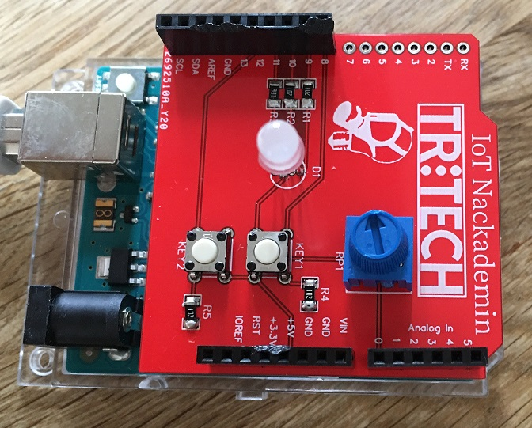

# Electric-RGB

## Functions
(a) Färgen (R, G och B) ska kunna växlas / ändras med KEY1

(b) Färgen ska även kunna sättas i ”fade-läge” / ”regnbågs-läge” med KEY2, där samtliga möjliga färger och alla nyanser emellan ska skifta fram mjukt och fint av sig själva.

(c) Hastigheten på ”fade-läget” (hur fort LEDen skiftar färg) ska gå att styra med trim-potentiometern.

## Attachment

